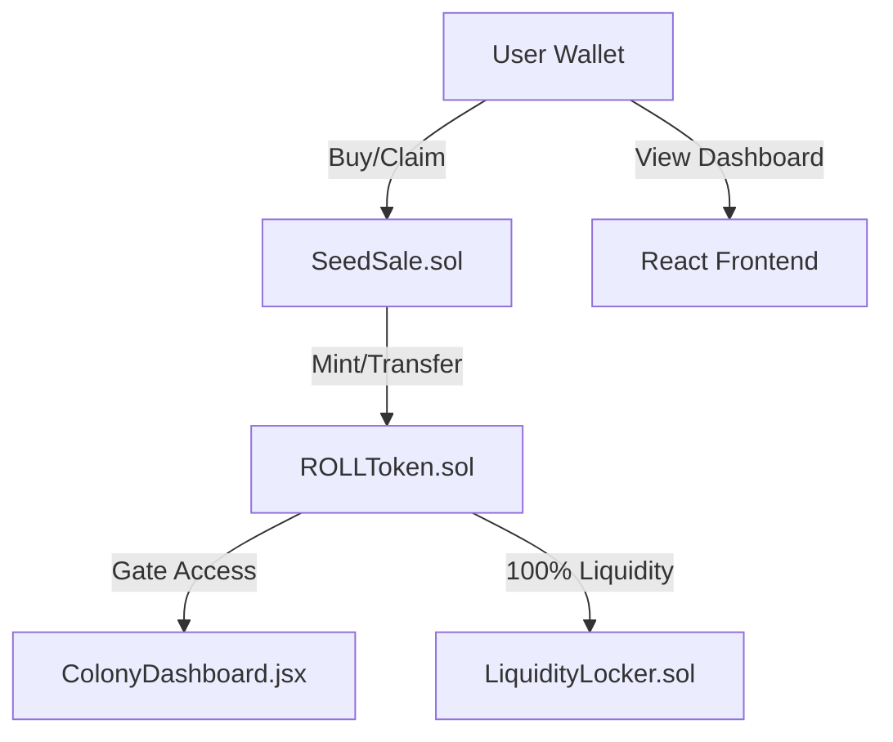

# ROLL Token Protocol

> **The Currency of Physical Resilience.**
> A Web3 ecosystem for financing, building, and accessing off-grid infrastructure.

  

---

## 🌍 The Vision

ROLL is not just a token; it is the **operating system for a sovereign physical network**. We bridge the gap between digital assets (DeFi) and real-world utility (RWA).

Our mission is to create a closed-loop economy where the token is used to:
1.  **Purchase** off-grid equipment (Solar, Water, Connectivity) at exclusive discounts.
2.  **Access** gated communities and physical locations.
3.  **Govern** a DAO dedicated to acquiring land and building resilient infrastructure.

## 🏗 Architecture

The ROLL Protocol consists of a cohesive ecosystem of smart contracts and dApps:

### System Diagram


### Core Components
1.  **The Launchpad (DApp)**: React/Vite/Wagmi frontend.
    *   **Smart Contract**: `SeedSale.sol` (0x4D9c...8c9f) - Manages deposits, soft cap (50 BNB), and refunds.
    *   **Gating**: `ColonyDashboard.jsx` - Unlocks specific UI elements based on `contributions` mapping.
2.  **The Token ($ROLL)**: Standard BEP-20 with fixed supply.
    *   **Address**: `0x...` (Pending Deployment)
3.  **The Colony (Utility)**: Token-gated access to discounts.

---

## 📊 Tokenomics

A fixed-supply model designed for scarcity and value retention.

| Category | Allocation | Amount | Vesting/Lockup |
| :--- | :--- | :--- | :--- |
| **Total Supply** | 100% | 1,000,000,000 ROLL | Fixed |
| **Seed Sale** | 30% | 300,000,000 ROLL | 10% TGE, then linear 9 mos |
| **Liquidity** | 20% | 200,000,000 ROLL | **LOCKED 1 YEAR** (On-Chain) |
| **Eco-Mining** | 30% | 300,000,000 ROLL | Minted via "Proof of Work" (Hardware) |
| **Marketing** | 10% | 100,000,000 ROLL | 3-month cliff, then 24 mos vesting |
| **Team** | 10% | 100,000,000 ROLL | **LOCKED 6 MONTHS**, then 36 mos vesting |

### Grant & Emission Mechanics
*   **Eco-Mining**: Released only when new "BeetleBox" hardware nodes come online (Physical Proof of Work).
*   **Burn Mechanism**: Unsold Seed Sale tokens are burned to increase scarcity.

---

## 🛠 Technology Stack

*   **Blockchain**: Binance Smart Chain (BSC)
*   **Contracts**: Solidity 0.8.20 (OpenZeppelin Standard)
*   **Frontend**: React + Vite + TailwindCSS
*   **Web3 Integration**: Wagmi + RainbowKit + Viem
*   **Hosting**: Vercel

---

## 🚀 Roadmap

| Phase | Milestone | Status |
| :--- | :--- | :--- |
| **Phase 1** | **Seed Sale & Community Building** | 🟢 **Live** |
| Phase 2 | DEX Listing & Liquidity Lock | 🟡 Pending |
| Phase 3 | Partner Store Integration (Solar/Starlink) | 🟡 In Progress |
| Phase 4 | First Land Acquisition Proposal | ⚪ Q4 2026 |

---

## 🔒 Security & Trust

*   **Liquidity**: 100% of Raised BNB is automatically locked via `LiquidityLocker.sol`.
*   **Audit**: Contracts verified on BscScan.
*   **Team**: KYC Verified (Badge visible in DApp).

---

## 📦 Installation (Developers)

```bash
# Clone the repository
git clone https://github.com/shelbyahobi/roll-token-official-.git

# Install dependencies
npm install

# Run local development server
npm run dev
```

---

*Verified by the ROLL DAO Council.*
