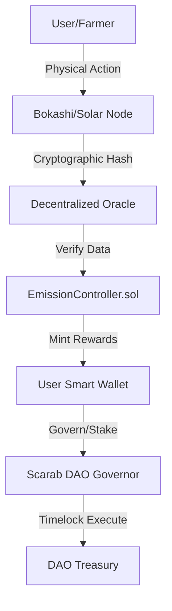

# SCARAB Protocol

> **Hardware-verified ecological production on BNB Smart Chain.**

**Website:** [scarabprotocol.org](https://www.scarabprotocol.org/)

  

---

## The vision

SCARAB is a DePIN stack that connects certified devices (solar, bokashi / organic waste, and future node types) to on-chain validation and emissions. The **$SCARAB** token coordinates incentives for verified physical output—not speculative hash mining.

Our mission is a closed-loop economy where the token is used to:

1. **Purchase** hardware and services at partner conditions.
2. **Access** gated product and governance features.
3. **Govern** treasury and protocol upgrades through on-chain voting (where deployed).

## Architecture

The SCARAB Protocol ties together smart contracts, oracle ingestion, and dApps:

### System diagram



### Core components

1. **Frontend (Vite/React)**: Launchpad, transparency views, docs — deployed on Vercel behind [scarabprotocol.org](https://www.scarabprotocol.org/).
2. **Token ($SCARAB)**: BEP-20 with fixed supply cap (see `ScarabToken.sol`).
3. **Seed sale & colony**: Token-gated flows and contributions per deployed contracts.

---

## Tokenomics (summary)

Fixed supply governed by a long-horizon emission decay. See the in-app tokenomics section and `contracts/` for authoritative parameters.

| Category | Allocation | Notes |
| :--- | :--- | :--- |
| **Total supply** | 1,000,000,000 SCARAB | Fixed cap |
| **Eco / regen pool** | 30% | Emission schedule |
| **Seed sale** | 30% | Per sale terms |
| **Liquidity** | 15–25%** | Per deployment |
| **Marketing / team** | Per schedule | Vesting / timelocks |

**Allocations vary by deployment; verify on-chain.**

---

## Security & transparency

- Vesting and timelocks where deployed (`TeamVesting`, marketing timelock, etc.).
- Hardware uses secure-element signing for telemetry attestation.
- Third-party audit status should be cited from actual reports before claiming completion in public materials.

## Public disclosures

The public website and repository are intended to provide:
- architecture and protocol behavior at a high level,
- testnet contract visibility and technical progress,
- risk-aware, non-promissory communication.

The following are not published publicly by default and are shared in a controlled diligence process:
- detailed BOM/vendor pricing and sensitive manufacturing terms,
- full financial model assumptions and downside cases,
- confidential partner pipeline documents and legal memoranda.

This separation is intentional for security, confidentiality, and compliance.

---

## Tech stack

- **Chain:** BNB Smart Chain (BSC)
- **Contracts:** Solidity 0.8.x, OpenZeppelin
- **Frontend:** React, Vite, Tailwind, Wagmi, RainbowKit
- **Hosting:** Vercel + custom domain on Cloudflare

---

## Development

```bash
git clone <your-repository-url>
cd <repo>
cd frontend && npm install && npm run dev
```

For contracts:

```bash
cd contracts && npm install
npx hardhat test
```

---

## Environment variables (frontend)

| Variable | Purpose |
| :--- | :--- |
| `VITE_SCARAB_TOKEN_ADDRESS` | SCARAB BEP-20 address (preferred) |
| `VITE_ROLL_TOKEN_ADDRESS` | Legacy alias; still read if set |
| `VITE_SEED_SALE_ADDRESS` | Seed sale contract |
| `VITE_CHAIN_ID` | e.g. `97` testnet, `56` mainnet |

Set these in Vercel Project → Settings → Environment Variables.

---

*SCARAB Protocol — see [scarabprotocol.org](https://www.scarabprotocol.org/) for the public site.*
