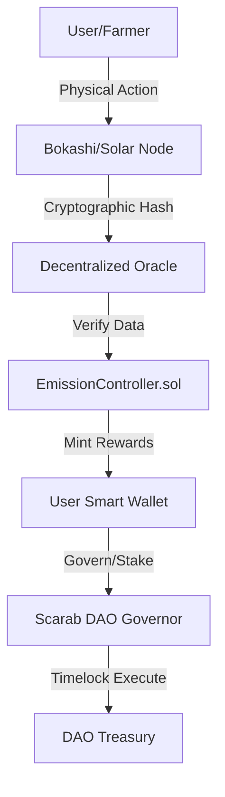

# ROLL Token Protocol

> **The Currency of Physical Resilience.**
> A Web3 ecosystem for financing, building, and accessing off-grid infrastructure.

  

---

## 🌍 The Vision

ROLL is not just a token; it is the **operating system for a sovereign physical network**. We bridge the gap between digital assets (DeFi) and real-world utility (RWA).

Our mission is to create a closed-loop economy where the token is used to:
1.  **Purchase** off-grid equipment (Solar, Water, Connectivity) at exclusive discounts.
2.  **Access** gated communities and physical locations.
3.  **Govern** a DAO dedicated to acquiring land and building resilient infrastructure.

## 🏗 Architecture

THE SCARAB Protocol consists of a cohesive ecosystem of smart contracts, physical hardware, and dApps:

### System Diagram


### Core Components
1.  **The Launchpad (DApp)**: React/Vite/Wagmi frontend.
    *   **Smart Contract**: `SeedSale.sol` (0x4D9c...8c9f) - Manages deposits, soft cap (50 BNB), and refunds.
    *   **Gating**: `ColonyDashboard.jsx` - Unlocks specific UI elements based on `contributions` mapping.
2.  **The Token ($ROLL)**: Standard BEP-20 with fixed supply.
    *   **Address**: `0x...` (Pending Deployment)
3.  **The Colony (Utility)**: Token-gated access to discounts.

---

## 📊 Institutional Tokenomics & Monetary Policy

A fixed-supply model designed for scarcity, governed by a rigorous emission decay curve (`e^(-λt)`).

| Category | Allocation | Amount | Vesting/Lockup |
| :--- | :--- | :--- | :--- |
| **Total Supply** | 100% | 1,000,000,000 SCARAB | Fixed Cap |
| **Eco-Mining (Regen Pool)** | 30% | 300,000,000 SCARAB | Released over 70+ years via algorithm |
| **Seed Sale** | 30% | 300,000,000 SCARAB | 10% TGE, then linear 9 mos |
| **Liquidity** | 15% | 150,000,000 SCARAB | **LOCKED 1 YEAR** (On-Chain) |
| **Marketing** | 10% | 100,000,000 SCARAB | **48-Hour Timelock + 3-of-5 Multi-Sig** |
| **Team** | 15% | 150,000,000 SCARAB | **12-Month Cliff, then 24-Month Linear** |

### Grant & Emission Mechanics
*   **Production-Gated Minting**: Tokens are minted ONLY when verified physical ecological output occurs.
*   **Burn Mechanism**: Unsold Seed Sale tokens are burned to increase scarcity.

---

## 🔒 Security, Transparency & Trust

*   **Zero-Trust Vesting**: The 15% Team allocation and 10% Marketing allocation are mathematically locked in verified smart contracts (`TeamVesting.sol`, `MarketingTimelock.sol`).
*   **Hardware Security**: All nodes utilize ATECC608A cryptographic coprocessors to prevent simulation attacks.
*   **Live Transparency**: The frontend "Protocol Vault" automatically parses the blockchain to display live treasury and vesting balances.
*   **Audit**: Core contracts undergoing rigorous third-party auditing prior to Mainnet launch.

---

## 🛠 Technology Stack

*   **Blockchain**: Binance Smart Chain (BSC)
*   **Contracts**: Solidity 0.8.20 (OpenZeppelin Standard)
*   **Frontend**: React + Vite + TailwindCSS
*   **Web3 Integration**: Wagmi + RainbowKit + Viem
*   **Hosting**: Vercel

---

## 🚀 Roadmap Milestones

| Phase | Milestone | Status |
| :--- | :--- | :--- |
| **Phase 1** | **Audit, Testnet, & Institutional Prep** | 🟢 **Live** |
| Phase 2 | Mainnet TGE & Transparency Dashboard | 🟡 Q1 |
| Phase 3 | First 1,000 Solar Nodes & Bokashi Kits Deployed | ⚪ Q2 |
| Phase 4 | Decentralized Oracle (EigenLayer AVS) Integration | ⚪ Q4 |

---

## 📦 Installation (Developers)

```bash
# Clone the repository
git clone https://github.com/shelbyahobi/roll-token-official-.git

# Install dependencies
npm install

# Run local development server
npm run dev
```

---

*Verified by the ROLL DAO Council.*
